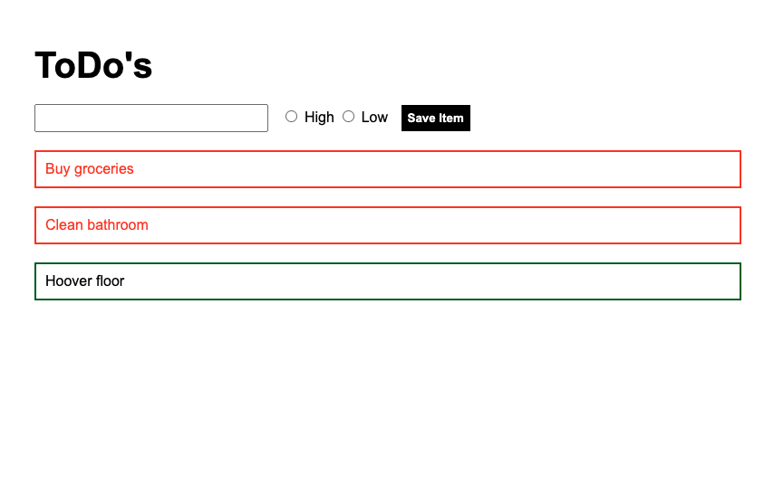
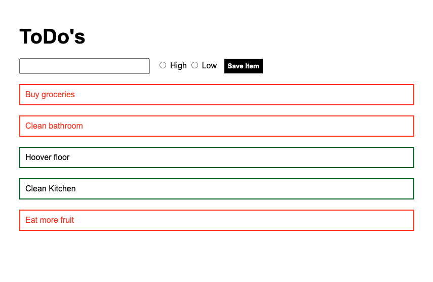

# ToDo List

## Brief

- Create a todo list application that allows a user to save an item to a list which then renders on the page
- Each item has two values: A name and a priority
- Give the user visual feedback on what priority level each todo has 

## Technologies

- Vue
- Webpack

Application once opened:

The user can add new todos to the list. Todos with a high priority show up in red, todos with a low priority show up in green.

